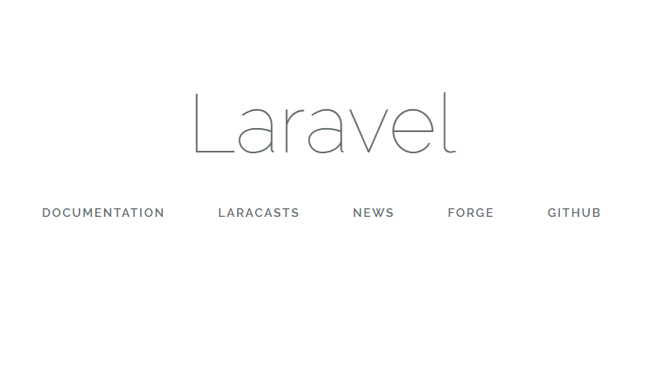

# BR INTRO
BR에 오신것을 환영합니다.

## 할것 리스팅
  * 라라벨 익히기 : [라라벨 메뉴얼 링크](https://laravel.kr/)
    * 라라벨에 명시된 홈스테드 환경 대신 XAMPP를 사용한다
      * XAMPP 설치
      * SYMPHONY 설치
      * XAMPP + SYMPHONY 환경 구성 [참조링크](https://www.codementor.io/magarrent/how-to-install-laravel-5-xampp-windows-du107u9ji)
      * 다음처럼 나오면 정상
      
  * INDEX 꾸미기
  * MYSQL 연습
    * [MYSQL 튜토리얼1](http://www.w3big.com/ko/mysql/default.html)
    * [MYSQL 튜토리얼2](https://www.w3schools.com/sql/)
